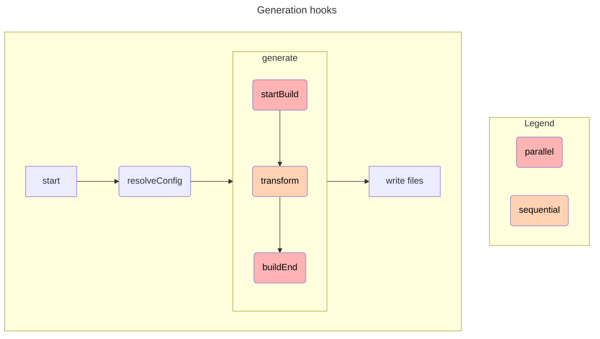

# Using Plugins

`@workleap/create-schemas` can be extended using plugins. Plugins can be used
to ouput new files or modify files created by other plugins.

## Adding a Plugin

To use a plugin, you need to include it in the `plugins` array in the
`create-schemas.config.ts` config file. For example:

```ts #2,5 create-schemas.config.ts 
import { defineConfig } from "@workleap/create-schemas";
import { openapiFetchPlugin } from "@workleap/create-schemas/plugins";

export default defineConfig({
    plugins: [openapiFetchPlugin()]
    input: "v1.yaml",
    outdir: "dist",
});
```

## Built-in Plugins

### `experimental_openapiFetchPlugin`

**Description:**

This plugins outputs a very thin client based on [OpenAPI Fetch](https://openapi-ts.pages.dev/openapi-fetch/). This client is based on the [Fetch API](https://developer.mozilla.org/en-US/docs/Web/API/Fetch_API) and is fully typesafe.

To use this client, you need to install the [openapi-fetch](https://www.npmjs.com/package/openapi-fetch) package:

+++ pnpm
```bash
pnpm add openapi-fetch
```
+++ npm
```bash
npm install openapi-fetch
```
+++ yarn
```bash
yarn add openapi-fetch
```
+++

**Example usage:**

```ts #2,5 create-schemas.config.ts 
import { defineConfig } from "@workleap/create-schemas";
import { experimental_openapiFetchPlugin } from "@workleap/create-schemas/plugins";

export default defineConfig({
    plugins: [experimental_openapiFetchPlugin()]
    input: "v1.yaml",
    outdir: "codegen",
});
```

```ts
import { createClient } from "./codegen/client.ts";

const client = createClient({ baseURL: "https://example.com" });

const { data, error } = await client.GET("/good-vibes-points/{userId}", {
    params: { path: { userId: "123" } } });

if (error) {
    console.error(error.title);
    console.error(error.detail);
}

if (data?.point) {
    console.log(`You have ${data.point} good vibes points!`);
}
```

### `experimental_openapiMSWPlugin`

!!!warning Warning

This plugin is currently marked as **experimental**. It may change at any time.

!!!

**Description:**

This plugins outputs a very thin wrapper over [openapi-msw](https://www.npmjs.com/package/openapi-msw). This package lets your define typed MSW handlers.

To use this client, you need to install the `openapi-msw` package:

+++ pnpm
```bash
pnpm add openapi-msw
```
+++ npm
```bash
npm install openapi-msw
```
+++ yarn
```bash
yarn add openapi-msw
```
+++

**Example usage:**

```ts #2,5 create-schemas.config.ts 
import { defineConfig } from "@workleap/create-schemas";
import { experimental_openapiMSWPlugin } from "@workleap/create-schemas/plugins";

export default defineConfig({
    plugins: [experimental_openapiMSWPlugin()]
    input: "v1.yaml",
    outdir: "codegen",
});
```

```ts #5-6
import { http } from "./codegen/openapi-msw.ts";

export const handlers = [
    http.get("/good-vibes-points/{userId}", ({ response }) => {
        return response(200).json({ pointx: 50 });
                                 // ^^^^^^ Property "pointx" does not exist on type { points: number }
    }),
];
```


## Creating a Plugin

!!!danger Danger

The Plugin API is currently marked as **unstable**. It may change at any time.

If you desire a specific plugin, please [open an issue on Github](https://github.com/gsoft-inc/wl-openapi-typescript/issues).
!!!

!!!
This work is inspired by [Rollup plugin development](https://rollupjs.org/plugin-development/).
!!!

A plugin is an object with a `name` and one or more [build hooks](#build-hooks), which follows our conventions. A plugin should export a function that can be called with plugin specific options and returns such an object.

Plugins allow you to customize `@workleap/create-schemas` behavior by, for example, modifying code before writing the files to disk.

### A Simple Example

The following plugin will add a comment at the top of every generated file.

```ts header-plugin.ts
export function headerPlugin() {
  return {
    name: "header-plugin",
    transform({ code }) {
      const comment = "/* Hello from the header plugin */";
      return {
        code: `${comment}\n${code}`;
      }
    }
  }
}
```

```ts create-schemas.config.ts
import { defineConfig } from "@workleap/create-schemas";
import { headerPlugin } from "./header-plugin.ts";

export default defineConfig({
  plugins: [headerPlugin()]
  input: "v1.json",
});
```

### Build hooks

To interact with the code generation process, a plugin may include "hooks". Hooks are function that are are called at various stages of the generation. Hooks can affect how a build is run, add a file to the output, or modify a build once complete.



### buildStart

- **Type:** `(context: BuildStartContext) => void`

```ts
type EmittedFile = { id?: unknown, filename: string, code: string };

interface BuildStartContext {
    config: ResolvedConfig;
    emitFile: (file: EmittedFile) => void
}
```

The first hook that is called during the generation process. Use this to read the user configuration or emit new files.

### transform

- **Type:** `(context: TransformContext) => TransformResult | undefined`

```ts
type EmittedFile = { id?: unknown, filename: string, code: string };

interface TransformContext {
    id?: unknown;
    config: ResolvedConfig;
    filename: string;
    code: string;
    emitFile: (file: EmittedFile) => void;
}

interface TransformResult {
    code: string;
}
```

Use this hook to modify a file generated by another plugin or to emit new files
depending on the content of other files.


### buildEnd

- **Type:** `(context: BuildEndContext) => void`

```ts
interface BuildEndContext {
    config: ResolvedConfig;
    files: GenerationFile[];
}
```

Run code at the end of the generation. This can be used to analyze the code
that is being emitted.